# 🚀 PSeInt Language Server

A modern Language Server Protocol (LSP) implementation for the PSeInt programming language

[](https://python.org)
[](https://langserver.org)
[](LICENSE)
[](CONTRIBUTING.md)

Bringing modern IDE features to PSeInt development ✨

---

## ✨ Features

### Transform your PSeInt coding experience with modern IDE capabilities

#### 🔧 Smart Code Formatting

- Automatic indentation and spacing
- Proper keyword casing
- Consistent code style

#### 🚀 Modern Development

- Lightning-fast Ruff linting
- Pyright type checking
- Pre-commit hooks

#### 🧪 Quality Assurance

- Comprehensive test suite
- Coverage reporting
- CI/CD automation

#### 📦 Easy Setup

- Standard Python package installation
- Cross-platform support
- Entry point commands

#### 💡 Enhanced Code Intelligence

- Context-aware auto-completion for keywords, variables, and functions.
- Helpful code snippets for common PSeInt structures.
- Rich hover information for symbols (variable types, function signatures).
- Parameter signature help for functions and subprocesos during calls.

**🔌 Editor Support**: Neovim • VS Code • *More coming soon...*

## 🚀 Quick Start

### 🎯 Choose Your Path

| 👤 **User Path** | 🛠️ **Developer Path** |
|------------------|----------------------|
| **Goal**: Use PSeInt LSP in your editor | **Goal**: Contribute to the project |
| **Time**: ~5 minutes | **Time**: ~10 minutes |
| **Requirements**: Python 3.8+ | **Requirements**: Python 3.8+, Node.js, make |
| **Next Step**: [Installation for Users](#-for-users-lsp-usage) | **Next Step**: [Installation for Developers](#️-for-developers-contributing) |

---

### 📋 Workflow Overview

```mermaid
graph LR
    A[📥 Install Package] --> B[⚙️ Configure Editor]
    B --> C[📝 Open .psc file]
    C --> D[✨ Enjoy LSP features!]
    
    style A fill:#e1f5fe
    style B fill:#f3e5f5
    style C fill:#e8f5e8
    style D fill:#fff3e0
```



**🎯 Ready to start?** Pick your path above and let's get you set up with modern PSeInt development!

## 📦 Installation

### 👤 For Users (LSP Usage)

> **🎯 Perfect for**: Developers who want to use PSeInt LSP in their editor

**📋 Prerequisites:**

- 🐍 Python 3.8+

**⚡ Quick Setup:**

#### Option 1: Package Installation (Recommended)

```bash
# 📥 Clone and install as package
git clone https://github.com/icristianhernandez/pseint-lsp
cd pseint-lsp

# 🔧 Create virtual environment and install
python -m venv .venv
source .venv/bin/activate  # On Windows: .venv\Scripts\activate
pip install .

# 🚀 Verify installation
pseint-lsp  # Starts LSP server (Ctrl+C to stop)
pseint-format --help  # Shows CLI formatter help
```

**📍 Note the paths**: After installation, the commands are available as:

- `./venv/bin/pseint-lsp` (LSP server)
- `.venv/bin/pseint-format` (CLI formatter)

```bash
# Alternative verification using full paths
.venv/bin/pseint-lsp &  # Start LSP server in background
.venv/bin/pseint-format --help  # Show help
kill %1  # Stop background LSP server
```

#### Option 2: Development Installation

```bash
# 📥 Clone the repository
git clone https://github.com/icristianhernandez/pseint-lsp
cd pseint-lsp

# 🔧 Create virtual environment and install in development mode
python -m venv .venv
source .venv/bin/activate  # On Windows: .venv\Scripts\activate
pip install -e .

# 🚀 Verify installation
pseint-lsp  # Starts LSP server (Ctrl+C to stop)
```

**📍 Note the paths**: Commands are available as:

- `.venv/bin/pseint-lsp` (LSP server)
- `.venv/bin/pseint-format` (CLI formatter)

```bash
# Alternative verification using full paths
.venv/bin/pseint-lsp &  # Start LSP server in background
kill %1  # Stop background LSP server
```

**🎯 Next Steps:**

1. **⚙️ Configure your editor**: Follow the [Editor Integration](#-editor-integration) section below
2. **🚀 Start coding**: Open a `.psc` file and enjoy automatic formatting and LSP features!

> **💡 Pro Tip**: The LSP server runs automatically when you open PSeInt files in your configured editor using the `pseint-lsp` command!

### 🛠️ For Developers (Contributing)

> **🎯 Perfect for**: Contributors who want to modify or enhance the project

**📋 Prerequisites:**

- 🐍 Python 3.8+
- 🟢 Node.js (for Pyright type checker)
- ⚙️ `make` (for development automation)

**🚀 Quick Development Setup:**

```bash
# 📥 Clone and setup everything
git clone https://github.com/icristianhernandez/pseint-lsp
cd pseint-lsp
./setup-dev.sh

# 🛠️ Start developing
make dev              # Run the LSP server
make test             # Run tests
make help             # See all available commands
```

**🔧 Manual Development Setup:**

```bash
# ⚙️ Set up development environment
make setup
source .venv/bin/activate
pip install -e .     # Install package in development mode
make info
```

**⚡ Development Commands:**

| Command | Description | Use Case |
|---------|-------------|----------|
| `make help` | 📚 Show all available commands | Getting started |
| `make dev` | 🚀 Install deps + run server | Development |
| `make test` | 🧪 Run all tests | Testing |
| `make lint` | 🔍 Run linting (Ruff + Pyright) | Code quality |
| `make format` | ✨ Format code with Ruff | Code style |
| `make fix` | 🔧 Auto-fix code issues | Quick fixes |
| `make pre-commit` | ✅ Fix + lint + test (before committing) | Pre-commit |

## 🔌 Editor Integration

> **📍 For Users**: Configure your editor to automatically use the PSeInt LSP when editing `.psc` files.

### 📍 **Important: Path Customization Required**

The configuration examples below use `<repo-path>` as a placeholder path. **You must replace this with your actual installation directory**:

- **Linux/macOS**: `/home/yourusername/pseint-lsp` or `/Users/yourusername/pseint-lsp`
- **Windows**: `C:\Users\yourusername\pseint-lsp`

**Why is this necessary?** Unlike globally installed packages, the PSeInt LSP runs from your cloned repository directory using its virtual environment. Each user's installation path is unique based on where they cloned the repository.

**🔍 To find your path**:
```bash
cd pseint-lsp
pwd  # Shows current directory path - use this in your editor configuration
```

### � Neovim

#### 🎯 Option 1: Using installed package (Recommended)

```lua
-- Set up filetype detection
vim.filetype.add({
  extension = { psc = 'pseint' },
})

-- Configure PSeInt LSP using full path to virtual environment
vim.lsp.config('pseint-lsp', {
  cmd = { '<repo-path>/.venv/bin/pseint-lsp' },  -- Update this path
  filetypes = { 'pseint' },
  root_markers = { '.git', 'proyecto.psc' },
  name = 'pseint-lsp',
})

-- Enable the LSP
vim.lsp.enable('pseint-lsp')
```

#### 🔧 Option 2: Development mode (for contributors)

```lua
-- Set up filetype detection
vim.filetype.add({
  extension = { psc = 'pseint' },
})

-- Configure PSeInt LSP for development
vim.lsp.config('pseint-lsp', {
  cmd = { '<repo-path>/.venv/bin/python', '-m', 'pseint_lsp.server' },
  filetypes = { 'pseint' },
  root_markers = { '.git', 'proyecto.psc' },
  name = 'pseint-lsp',
  cwd = '<repo-path>',  -- Set to your project directory
})

-- Enable the LSP
vim.lsp.enable('pseint-lsp')
```

> **📍 Important**: Replace `<repo-path>` with the actual path to your cloned repository directory.

#### 📁 Dedicated configuration file

Create `~/.config/nvim/lsp/pseint-lsp.lua`:

```lua
return {
  cmd = { '<repo-path>/.venv/bin/pseint-lsp' },  -- Update this path
  filetypes = { 'pseint' },
  root_markers = { '.git', 'proyecto.psc' },
  name = 'pseint-lsp',
}
```

Then in your `init.lua`:

```lua
vim.filetype.add({ extension = { psc = 'pseint' } })
vim.lsp.enable('pseint-lsp')
```

> **📍 Important**: Replace `<repo-path>` with the actual path to your cloned repository directory.

### 💻 VS Code

#### 🎯 Option 1: VS Code Extension (Recommended - Coming Soon)

> **🚧 In Development**: A VS Code extension for PSeInt LSP is planned for future release. This will provide one-click installation from the VS Code marketplace.

#### ⚙️ Option 2: Manual LSP Configuration (Advanced Users)

For now, advanced users can manually configure the LSP using a VS Code extension that supports generic LSP servers:

**📦 Step 1: Install a generic LSP client extension**:

- Install [vscode-languageclient](https://marketplace.visualstudio.com/items?itemName=ms-vscode.vscode-json-languageservice) or
- Install [Generic LSP Client](https://marketplace.visualstudio.com/items?itemName=llvm-vs-code-extensions.vscode-clangd)

**⚙️ Step 2: Configure in VS Code settings.json**:

```json
{
  "files.associations": {
    "*.psc": "pseint"
  },
  "files.autoGuessEncoding": true,
  "languageserver": {
    "pseint": {
      "command": "<repo-path>/.venv/bin/pseint-lsp",
      "filetypes": ["pseint"],
      "rootPatterns": [".git", "proyecto.psc"]
    }
  }
}
```

> **📍 Important**: Replace `<repo-path>` with the actual path to your cloned repository directory.

> **⚠️ Important**: This manual approach requires technical knowledge and may not work reliably. We recommend waiting for the official VS Code extension or using Neovim for the best experience.

#### 🔤 Encoding Configuration

Regardless of the method used, configure VS Code for PSeInt file encoding:

```json
{
  "files.autoGuessEncoding": true
}
```

**🔧 Troubleshooting**: If you see corrupted characters, manually reopen files with "Western (ISO 8859-1)" encoding via Command Palette → "Reopen Editor With Encoding".

## 🎯 Usage

### 📝 Command Line Tools

After installation, you have access to these commands:

| Command | Description | Usage |
|---------|-------------|-------|
| `.venv/bin/pseint-lsp` | 🚀 Start LSP server | Used by editors automatically |
| `.venv/bin/pseint-format` | ✨ Format PSeInt files | `.venv/bin/pseint-format file.psc` |

#### 🔧 CLI Formatting Examples

```bash
# Activate virtual environment first
source .venv/bin/activate  # On Windows: .venv\Scripts\activate

# Format a single file
pseint-format archivo.psc

# Format with specific encoding
pseint-format --encoding utf-8 archivo.psc

# Format and save to different file
pseint-format archivo.psc --output formatted_archivo.psc

# Or use full path without activating venv
.venv/bin/pseint-format archivo.psc
```

### 📝 LSP Features in Editors

Once configured with your editor, the LSP provides powerful code formatting and navigation for PSeInt files.

| Action | Neovim | VS Code | Description |
|--------|--------|---------|-------------|
| Format Document | `<leader>lf` | `Shift+Alt+F` | Format entire file |
| Auto-format on save | Configure in settings | Configure in settings | Automatic formatting |
| Manual formatting | `:lua vim.lsp.buf.format()` | Command Palette | On-demand formatting |

### 🔧 LSP Features

| Keybinding | Action | Description |
|------------|---------|-------------|
| `grn` | 🏷️ Rename symbol | Rename variables/functions across files |
| `gra` | ⚡ Code actions | Quick fixes and refactoring |
| `grr` | 🔍 Show references | Find all symbol usages |
| `gd` | 🎯 Go to definition | Jump to symbol definition |
| `K` | 📖 Hover Information | Show detailed information about the symbol under the cursor (e.g., type, definition, parameters). |
| `Ctrl+Space` (Editor specific) | 💡 Auto-completion | Get suggestions for keywords, variables, functions, and snippets relevant to the current context. |
| `(` or `,` (in function call) | ℹ️ Signature Help | See parameter information for functions and subprocesos as you type. |

> **💡 Pro Tip**: These features work automatically once your editor is configured. Just open a `.psc` file and start coding!

## 🌐 File Encoding Support

### 📄 PSeInt Encoding

PSeInt uses **ISO-8859-1 (Latin-1)** encoding by default, with full support for Spanish characters:

**Supported Characters:**

- 🔤 **Accented vowels**: `á`, `é`, `í`, `ó`, `ú`
- 🔤 **Special characters**: `ñ`, `¿`, `¡`, `ü`

### ⚙️ Editor Configuration

**VS Code** - Enable auto-encoding detection:

```json
{
  "files.autoGuessEncoding": true
}
```

**🔧 Troubleshooting**: If you see corrupted characters, manually reopen files with "Western (ISO 8859-1)" encoding.

**🔄 Compatibility Check:**

- ✅ UTF-8 files: Fully supported
- ✅ ISO-8859-1 files: Supported with proper editor configuration  
- ⚠️ Mixed encoding: Use consistent encoding across project files

## 🛠️ Development

### 📁 Project Structure

```text
├── 📦 pseint_lsp/            # Main package
│   ├── 🚀 server.py          # Main LSP server
│   ├── ✨ formatter.py       # PSeInt formatting logic  
│   ├── 🔧 cli_formatter.py   # CLI formatting tool
│   ├── 💡 completions.py     # Auto-completion features
│   └── 📝 pseint_parser.py   # PSeInt syntax parser
├── 🧪 tests/                 # Test suite
├── 📚 docs/                  # Documentation
├── 📋 pyproject.toml         # Package configuration
├── ⚙️ Makefile               # Development automation
├── 📦 requirements.txt       # Production dependencies
└── 🧪 requirements-dev.txt   # Development dependencies
```

### 📝 Formatting Rules

The formatter implements comprehensive PSeInt formatting with precision:

- **🔤 Keywords**: Proper casing (`proceso` → `Proceso`, `finsi` → `FinSi`)
- **📏 Indentation**: 4-space indentation for code blocks
- **🎯 Spacing**: Normalized spacing around operators and keywords
- **📄 Blank Lines**: Removes excessive blank lines and trailing whitespace
- **💬 Comments**: Preserves comments with proper spacing

### 🧪 Testing

```bash
# Run all tests
make test

# Run with coverage  
make test-cov

# Run specific tests
python -m pytest tests/test_formatter.py -v

# Watch mode (auto-restart on changes)
make test-watch
```

### 🎯 Code Quality

Modern tooling for development excellence:

- **🚀 Ruff**: Fast linting and formatting
- **🔍 Pyright**: Static type checking  
- **🧪 Pytest**: Testing framework with async support
- **🔗 Pre-commit**: Git hooks for code quality

### 🏗️ Architecture

The LSP server is built using modern Python practices:

- **📡 pygls**: Python LSP server framework
- **⚡ asyncio**: Asynchronous I/O for LSP communication
- **🧩 Modular design**: Separate formatter and server components
- **✅ Comprehensive testing**: Unit, integration, and end-to-end tests
- **📦 Standard packaging**: Uses pyproject.toml and setuptools entry points

## 🤝 Contributing

Contributions are welcome! This project follows modern Python development practices.

### 🚀 Development Setup

1. **🍴 Fork and clone** the repository
2. **⚙️ Set up development environment**:

   ```bash
   make setup
   source .venv/bin/activate
   pip install -e .  # Install package in development mode
   ```

3. **🔗 Install pre-commit hooks**:

   ```bash
   pre-commit install
   ```

### 🔄 Development Workflow

```bash
# Make your changes, then run quality checks
make fix             # 🔧 Auto-fix code style issues
make lint            # 🔍 Check code quality
make test            # 🧪 Run tests
make pre-commit      # ✅ Full pre-commit check
```

### 📋 Pull Request Guidelines

1. **🌟 Create a feature branch** for your changes
2. **🧪 Add tests** for new functionality
3. **📚 Update documentation** if necessary
4. **✅ Run quality checks**: `make pre-commit`
5. **🧪 Ensure all tests pass**: `make test`
6. **🏷️ Add type hints** to new Python code
7. **🎨 Follow existing code style** (automatically enforced by Ruff)

### ⭐ Special Contribution Areas

**🎯 VS Code Extension Development**:

- Help needed for creating a proper VS Code extension
- Knowledge of TypeScript and VS Code extension API beneficial
- Will significantly improve user experience

**🚀 Additional LSP Features**:

- Diagnostics and error reporting
- Auto-completion and IntelliSense
- Symbol navigation and refactoring

**🔌 Editor Integrations**:

- Configurations for other editors (Vim, Emacs, Sublime Text)
- Testing and validation across different platforms

## 🔮 Future Features

### 🚀 Planned LSP Enhancements

The project is designed to be easily extensible for additional LSP features:

- **🔍 Diagnostics**: Real-time syntax error detection and reporting.
- **↪️ Find References**: Find all usages of a symbol across a project (if applicable to PSeInt usage).
- **🛠️ Advanced Refactoring Tools**: More sophisticated refactoring options beyond basic symbol rename.
- **🧩 Cross-File Analysis**: (For users who might structure larger PSeInt projects across multiple files) Support for understanding symbols and dependencies across different files in a project.

### 📱 VS Code Extension

A dedicated VS Code extension is planned that will provide:

- **🎯 One-click installation** from VS Code marketplace
- **🤖 Automatic LSP server management** (no manual setup required)
- **🎨 PSeInt syntax highlighting** and theme support
- **🐛 Integrated debugging** and error reporting
- **📄 File templates** for new PSeInt projects

> **📅 Timeline**: VS Code extension development is planned for the next major release. Contributors welcome!

### 🌟 Editor Support Expansion

Future editor integrations planned:

- **🚀 Vim/Neovim**: Enhanced configuration and features
- **🎯 Emacs**: LSP client configuration
- **✨ Sublime Text**: LSP plugin support
- **🧠 IntelliJ IDEA**: Plugin development

## 📄 License

See [LICENSE](LICENSE) file for details.

---

## 🎯 Made with ❤️ for the PSeInt community

A modern IDE experience for PSeInt development

[](https://github.com/icristianhernandez/pseint-lsp)
[](https://github.com/icristianhernandez/pseint-lsp/fork)

**[⭐ Star this project](https://github.com/icristianhernandez/pseint-lsp) | [🐛 Report Bug](https://github.com/icristianhernandez/pseint-lsp/issues) | [💡 Request Feature](https://github.com/icristianhernandez/pseint-lsp/issues)**
